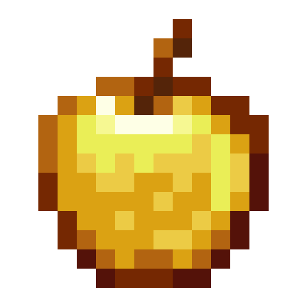

# old-animations

Old Animations is a free and open-source mod targeting the client-side of Minecraft that backport animations from legacy
versions to newer ones.

# Table of contents

* [Animations](#animations)
* [Downloads](#downloads)
* [Contributing][contributing]
* [Versioning Strategy](#versioning-strategy)
* [Compiling](#compiling)
  * [Prerequisites](#prerequisites)
  * [Getting Started](#getting-started)
* [Credits](#credits)
* [License](#license)

# Animations

* [x] Legacy Sneaking (1.7.x)
* [x] Legacy Bow Position and Scaling
* [x] Legacy Rod Position and Scaling
* [x] Sword Blocking & blockhitting
  * Blockhitting animation depends on swing speed.
* [ ] Legacy player list (no heads, no footer and no header)
* [ ] Swing at ground while eating
* [ ] Armor flashing when player takes damage

# Downloads

You can find downloads for Old Animations on either the [CurseForge page][curseforge] or through
the [GitHub Releases page][releases]. Usually, releases will be made on GitHub slightly sooner than
[CurseForge][curseforge].

## Versioning Strategy

The Old Animations Project uses [Semantic Versioning 2.0.0][semantic_versioning] as their versioning strategy:

```
Given a version number MAJOR.MINOR.PATCH, increment the:

  1. MAJOR version when you make incompatible API changes,
  2. MINOR version when you add functionality in a backwards compatible manner, and
  3. PATCH version when you make backwards compatible bug fixes.

Additional labels for pre-release and build metadata are available as extensions to the MAJOR.MINOR.PATCH format.
```

# Compiling

### Prerequisites

You will need to install [JDK][jdk] _(acronym for **J**ava **D**evelopment **K**it)_ <u>at least version 8</u> in order
to build the Old Animations Project. We highly recommend [AdoptOpenJDK][jdk] due to its performance and stability. You
can either install this over a package manager on Windows, Linux or macOS by following the installation guide for the
selected JDK distribution. If you'd prefer to not use a package manager, you can grab the installers or packages
directly from the `Downloads` page.

Obviously, you also will need [Git][git] to clone our GitHub repository instead of cloning using the GitHub interface.

### Getting started

Clone the repository using `git clone https://github.com/nekkan/old-animations.git`.

```
$ git clone https://github.com/nekkan/old-animations
Cloning into 'old-animations'...
remote: Enumerating objects: 698, done.
remote: Counting objects: 100% (698/698), done.
remote: Compressing objects: 100% (225/225), done.
remote: Total 698 (delta 201), reused 694 (delta 197), pack-reused 0
Receiving objects: 100% (698/698), 115.85 KiB | 318.00 KiB/s, done.
Resolving deltas: 100% (201/201), done.
```

Navigate to the directory you've cloned this repository and build with Gradle using `./gradlew.bat build` on Windows or
`./gradlew build` if you are using macOS or a Linux distribution. The initial setup may take a few minutes. After Gradle
has finished preparing the environment for you and building everything, you can find the `.jar` artifact were is located
at `./build/libs` along the `*-dev.jar` artifact.

# Credits

* [Sword Blocking][sword_blocking] (models-only) by TeamMidnightDust

# License

The Old Animations Project is licensed under the **MIT** license. For more information, please check out the [license]
file.

[git]: https://git-scm.com/

[jdk]: https://adoptopenjdk.net/

[contributing]: https://github.com/nekkan/old-animations/blob/main/CONTRIBUTING.md

[releases]: https://github.com/nekkan/old-animations/releases

[license]: https://github.com/nekkan/old-animations/blob/main/LICENSE.md

[curseforge]: https://www.curseforge.com/minecraft/mc-mods/old-animations

[sword_blocking]: https://github.com/TeamMidnightDust/SwordBlocking

[semantic_versioning]: https://semver.org
